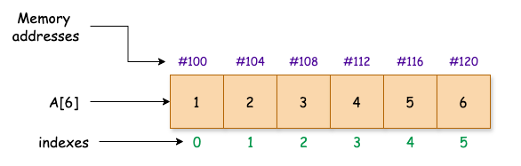
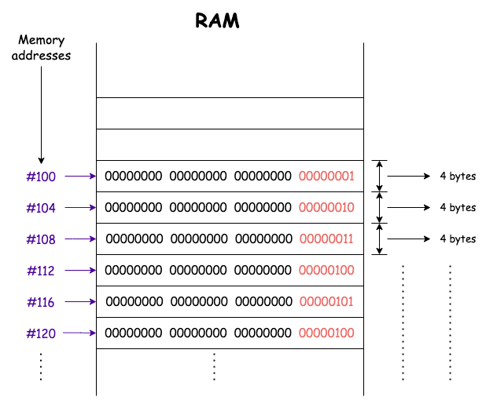

## Welcome to the course "Master Array Data Structure: From Zero To Hero."

This course teaches in-depth arrays, shifting and deletion algorithms, array construction from scratch, two-dimensional, and some of the most asked interview questions.

Thanks for choosing this course! This course will help you learn about arrays and develop strong algorithmic problem-solving skills.

> Elevate your tech career with our "Arrays Mastery" course. Gain expert insights, master essential algorithms, and excel in coding interviews.

Course link: https://ggorantala.dev/arrays-mastery

## What are Arrays?
Arrays are fundamental for storing sequential data and play a critical role in optimizing memory access patterns.

Modern CPUs utilize cache memory to enhance data retrieval speed, and accessing array elements sequentially can result in cache hits, significantly improving performance. This occurrence, known as "locality of reference," makes arrays particularly efficient for algorithms that sequentially traverse data.

Additionally, in multidimensional arrays, the way data is stored (row-major or column-major order) directly impacts computational task performance. Understanding these memory and access patterns can provide deep insights into performance optimization in high-performance computing and algorithm design.

With its precise knowledge, beginners can develop a deep understanding of the importance of accuracy in programming, forming a strong foundation for mastering other data structures and comprehending complex mathematical and computational networks.

Master the basic syntax of array can help you solve software problems at ease and develop real-world applications with confidence.

## Why Arrays got introduced?
Can arrays be replaced with primitives? This lesson teaches how arrays enhance algorithm performance and substitute primitive data types.

Let's take a step back and consider why we need arrays in the first place. 🤔
## Why not make use of primitives?
In Java `int` takes `4` bytes. So, the declaration below occupies `4` bytes of memory.

```java
int a = 100;
```

What if we want to store six `int` values (or `24` bytes)? We need to use six different variables individually, each occupying `4` bytes so that the total will be `6 * 4 = 24` bytes.

```java
// each of the following occupies 4 bytes, which is 6 * 4 bytes
int a1 = 100;
int a2 = 200;
int a3 = 300;
int a4 = 400;
int a5 = 500;
int a6 = 600;
```
Creating six different variables is a bit dirty and not a good idea. What if we wanted to store a million entries? Are we supposed to create a million different variables? 😢 Isn't this bad coding?

## Arrays to the rescue 🤩
Instead, we store the million items in an array sequentially in an `int[] array`. This can be achieved easily by following the declaration and initialization with values.

```java
int[] array = {100, 200, 300, 400, 500, 600};
```
Arrays are used for efficient data storage, quick access, and optimized memory usage.

Isn't the array beautiful? 😻

## Illustration
Each position in the array has an index, starting at the `0`th index. In Java, integers take `4` bytes, so the memory addresses of each adjacent element are added by `4` bytes.


A simple sketch of this as follows


> In above figure: Integer in Java takes `4` bytes. Array occupies the contiguous memory from `#100` to `#120`.

If we say our array memory, location/address starts from `100`, then the following integer address will start from `104(100+4)` bytes, and so on.

Figure above contains an array with `6` elements in it. So, theoretically, anything that we store after this array takes the address from `124`.

> Important Note: In Java, we have to specify the size of the array ahead of time before initializing the array.

We knew everything on the computer is stored in bits `0` or `1`.

Let's explore how "above Figure" can be represented in memory and addressed using binary.

RAM is a storage device viewed as shelves containing memory locations following figure 2 is just a mere zoomed version of how data is stored inside RAM.



Learn more about arrays in depth in the course. 

## What do you learn?
- Everything you need to know about arrays.
- 1D, 2D, 3D arrays.
- Prefix and suffix arrays.
- Leetcode problems.
- GitHub repository access - https://github.com/ggorantala/arrays-mastery.
- Estimated time: 15hrs to finish.

## Takeaway skills
  - **Interview-Focused Content**: This course is tailored specifically for coding interviews. It covers the array-related questions most frequently asked by top tech companies. You'll learn strategies to approach and solve these problems efficiently.
  - **Algorithm Mastery**: Beyond basic array operations, the course delves into algorithms commonly used in interviews, such as sorting, searching, and dynamic programming. Mastering these will give you a significant edge in technical interviews.
  - **Problem-Solving Techniques**: Gain access to a wide range of practice problems with varying difficulty levels. The course provides detailed solutions and explanations, helping you develop strong problem-solving skills and the ability to think critically under pressure.
  - **Expert Insights and Tips**: Learn from the instructor, who has firsthand experience conducting coding interviews at major tech companies.
  Investing in this course will thoroughly prepare you for coding interviews, enhance your problem-solving abilities, boost your confidence, and significantly increase your chances of landing your dream job in the tech industry.

